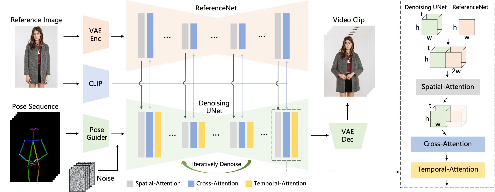

# ComfyUI-AnimateAnyone-Evolved
 Improved AnimateAnyone implementation that allows you to use the opse image sequence and reference image to generate stylized video.<br>
 ***The current goal of this project is to achieve desired pose2video result with 1+FPS on GPUs that are equal to or better than RTX 3080!🚀***
<br>

https://github.com/MrForExample/ComfyUI-AnimateAnyone-Evolved/assets/62230687/572eaa8d-6011-42dc-9ac5-9bbd86e4ac9d


## Currently Support
- Please check **[example workflows](./_Example_Workflow/)** for usage. You can use [Test Inputs](./_Example_Workflow/_Test_Inputs/) to generate the exactly same results that I showed here. (I got Chun-Li image from [civitai](https://civitai.com/images/3034077))
- Support different sampler & scheduler:
  - **DDIM**
    - 24 frames pose image sequences, `steps=20`, `context_frames=24`; Takes 835.67 seconds to generate on a RTX3080 GPU
    <br><video controls autoplay loop src="https://github.com/MrForExample/ComfyUI-AnimateAnyone-Evolved/assets/62230687/4e5f6b80-88a7-4bf8-9c81-7a00b5a02c76" muted="false" width="320"></video> 
    - 24 frames pose image sequences, `steps=20`, `context_frames=12`; Takes 425.65 seconds to generate on a RTX3080 GPU  
    <br><video controls autoplay loop src="https://github.com/MrForExample/ComfyUI-AnimateAnyone-Evolved/assets/62230687/5691ac83-1400-43e2-a930-531d7695e506" muted="false" width="320"></video>
  - **DPM++ 2M Karras**
    - 24 frames pose image sequences, `steps=20`, `context_frames=12`; Takes 407.48 seconds to generate on a RTX3080 GPU
    <br><video controls autoplay loop src="https://github.com/MrForExample/ComfyUI-AnimateAnyone-Evolved/assets/62230687/45c6aaeb-b750-4d44-8c31-edbdcf1068d8" muted="false" width="320"></video>
  - **LCM**
    - 24 frames pose image sequences, `steps=20`, `context_frames=24`; Takes 606.56 seconds to generate on a RTX3080 GPU
    <br><video controls autoplay loop src="https://github.com/MrForExample/ComfyUI-AnimateAnyone-Evolved/assets/62230687/e8c712ec-fc7f-4679-ae41-99449f4f76aa" muted="false" width="320"></video>
    - Note:<br>*Pre-trained LCM Lora for SD1.5 does not working well here, since model is retrained for quite a long time steps from SD1.5 checkpoint, however retain a new lcm lora is feasible*
  - **Euler**
    - 24 frames pose image sequences, `steps=20`, `context_frames=12`; Takes 450.66 seconds to generate on a RTX3080 GPU
    <br><video controls autoplay loop src="https://github.com/MrForExample/ComfyUI-AnimateAnyone-Evolved/assets/62230687/6a5b7c28-943d-4ff2-83de-3460ab1a6b61" muted="false" width="320"></video>
  - **Euler Ancestral**
  - **LMS**
  - **PNDM**
- Support add Lora
  - I did this for insert lcm lora
- Support quite long pose image sequences
  - Tested on my RTX3080 GPU, can handle 120+ frames pose image sequences with `context_frames=24`
  - As long as system can fit all the pose image sequences inside a single tensor without GPU memory leak, then the main parameters will determine the GPU usage is `context_frames`, which does not correlate to the length of pose image sequences.
- Current implementation is adopted from [Moore-AnimateAnyone](https://github.com/MooreThreads/Moore-AnimateAnyone), 
  - I tried to break it down into as many modules as possible, so the workflow in ComfyUI would closely resemble the original pipeline from AnimateAnyone paper:
    <br>

## Will Do Next
- Train a LCM Lora for denoise unet (**Estimated speed up: 5X**)
- Convert Model using [stable-fast](https://github.com/chengzeyi/stable-fast) (**Estimated speed up: 2X**)
- Implement the compoents (Residual CFG) proposed in [StreamDiffusion](https://github.com/cumulo-autumn/StreamDiffusion?tab=readme-ov-file) (**Estimated speed up: 2X**)
- Incorporate the implementation & Pre-trained Models from [Open-AnimateAnyone](https://github.com/guoqincode/Open-AnimateAnyone) & [AnimateAnyone](https://github.com/HumanAIGC/AnimateAnyone) once they released
- Training a new Model using better dataset to improve results quality (Optional, we'll see if there is any need for me to do it ;)
- Continuous research, always moving towards something better & faster🚀

## Install (Will add it to ComfyUI Manager Soon!)

1.  Clone this repo into the  `Your ComfyUI root directory\ComfyUI\custom_nodes\` and install dependent Python packages:
    ```bash
    cd Your_ComfyUI_root_directory\ComfyUI\custom_nodes\

    git clone https://github.com/MrForExample/ComfyUI-AnimateAnyone-Evolved.git

    pip install -r requirements.txt
    ```
2. Download pre-trained models:
    - [stable-diffusion-v1-5_unet](https://huggingface.co/runwayml/stable-diffusion-v1-5/tree/main/unet)
    - [Moore-AnimateAnyone Pre-trained Models](https://huggingface.co/patrolli/AnimateAnyone/tree/main)
    - Above models need to be put under folder [pretrained_weights](./pretrained_weights/) as follow:
    ```text
    ./pretrained_weights/
    |-- denoising_unet.pth
    |-- motion_module.pth
    |-- pose_guider.pth
    |-- reference_unet.pth
    `-- stable-diffusion-v1-5
        |-- feature_extractor
        |   `-- preprocessor_config.json
        |-- model_index.json
        |-- unet
        |   |-- config.json
        |   `-- diffusion_pytorch_model.bin
        `-- v1-inference.yaml
    ```
    - Download clip image encoder (e.g. [sd-image-variations-diffusers ](https://huggingface.co/lambdalabs/sd-image-variations-diffusers/tree/main/image_encoder)) and put it under `Your_ComfyUI_root_directory\ComfyUI\models\clip_vision`
    - Download vae (e.g. [sd-vae-ft-mse](https://huggingface.co/stabilityai/sd-vae-ft-mse/tree/main)) and put it under `Your_ComfyUI_root_directory\ComfyUI\models\vae`
